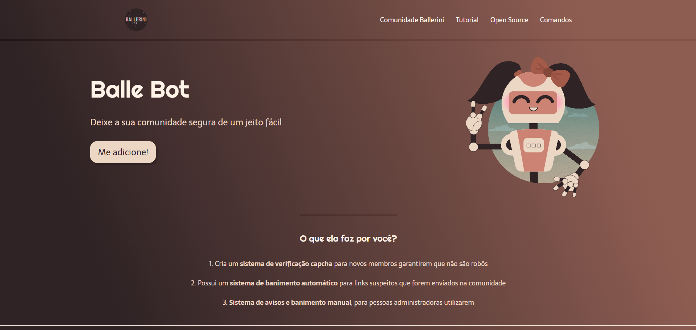

# 🎉 Balle Bot - Modere a sua Comunidade do Discord de Forma Simples e Eficiente! 🎉

Bem-vindo ao **Balle Bot**! 🛡️ Um bot criado especialmente para ajudar a moderar sua comunidade do Discord, garantindo um ambiente seguro e acolhedor para todos os membros. Com a nossa interface amigável e funcionalidades poderosas, você pode ficar tranquilo sabendo que sua comunidade está em boas mãos.

## 🌟 Visão Geral

O **Balle Bot** é uma landing page criada para promover um bot de moderação de Discord que facilita o trabalho de administradores e moderadores. Com uma interface visual atraente e moderna, a página explica de forma clara e direta as funcionalidades do bot, que incluem:

- **Sistema de verificação CAPTCHA** para garantir que novos membros não sejam robôs.
- **Sistema de banimento automático** para links suspeitos enviados na comunidade.
- **Sistema de avisos e banimentos manuais**, dando maior controle aos administradores.

## 🖼️ Layout Moderno e Atraente

Esta landing page foi desenhada com um design moderno e responsivo para fornecer uma experiência de usuário agradável tanto em dispositivos desktop quanto móveis. Utilizando fontes da Google Fonts como "Righteous" e "Sarala", a estética da página é única e impactante.



## 🚀 Funcionalidades

- **Cabeçalho Personalizado**: Contendo o logotipo da Comunidade Ballerini e um menu de navegação que facilita a interação dos usuários.
- **Seção Principal**: Com o título do projeto e um call-to-action destacado, convidando os usuários a adicionar o bot à sua comunidade.
- **Seção de Benefícios**: Explicação clara e objetiva das vantagens que o Balle Bot oferece.
- **Rodapé Minimalista**: Inclui o logotipo e mantém o design limpo e organizado.

## 🛠️ Tecnologias Utilizadas

- **HTML5** para a estruturação do conteúdo da página.
- **CSS3** para estilização e layout responsivo.
- **Google Fonts** para fontes personalizadas que melhoram a estética.

## 🎨 Design

A combinação de cores e o gradiente de fundo dão um ar sofisticado e acolhedor, criando um ambiente visualmente agradável para os usuários. A tipografia foi cuidadosamente escolhida para combinar com a vibe da comunidade e do produto.

## ⚙️ Como Usar

1. Clone o repositório:
   ```bash
   git clone https://github.com/karoldamiani/Landing-Page.git
